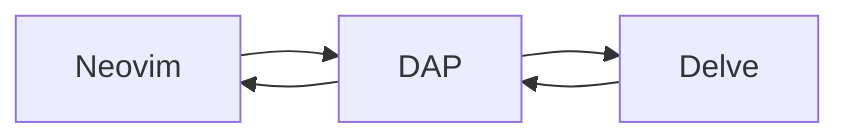

In this post I'll show how can we setup a debbuger for the Go programming language on the Neovim text editor.

The full config can be found in this [repo](https://github.com/leonardovee/go-debugger-setup).

### Why should you use a debugger?

There's a time when a programmer gets sick of the old `print()` debugging method, maybe there are scenarios that it doesn't properly work? Or the feedback loop is so slow that debugging becomes a nightmare? Either way, the debugger is a good tool to have on your arsenal and I'm here to help with that.


### What do I need before we start?

To follow the post you will need:

- Both Go and Neovim  already installed on the system
- Some Neovim package manager of your liking

### Why a package manager?

I've zero idea how to install stuff on Neovim without a package manager, and also, I'm too lazy to learn.
Just throw a line on a config file and everything works, for reference, I'll be using [LazyVim](https://github.com/LazyVim/LazyVim) as my package manager on this post.

And with a package manager there's the plugins. We will be using the following ones:
- [nvim-dap](https://github.com/mfussenegger/nvim-dap) is a client for the DAP (Debug Adapter Protocol).
- [nvim-dap-go](https://github.com/leoluz/nvim-dap-go) is responsible for launching the Go debugger.
- [nvim-dap-ui](https://github.com/rcarriga/nvim-dap-ui) this one makes the interface pretty and usable.

Along with those plugins we'll be installing the Go debugger called [Delve](https://github.com/go-delve/delve) on your system. 

We'll be going over this installation stuff in a bit, but before that we need to understand how the whole thing works.

### How the whole thing works

In simple terms, we'll be using a bunch of apis to have a fancy debugger, the flow off the stuff is something like this:



What the well is DAP? DAP is the Debug Adapter Protocol, it's a protocol that allows the communication between a debugger and a client, in this case, the debugger is Delve and the client is Neovim.

The [nvim-dap](https://github.com/mfussenegger/nvim-dap) makes Neovim capable of interact with the DAP by implementing its interface. The [nvim-dap-go](https://github.com/leoluz/nvim-dap-go) is what launches the debugger. And [Delve](https://github.com/go-delve/delve) is the debugger that we're using.

But, why so many abstractions? Can't we just run some software, set breakpoints and debug the code?

Well, we can, but it will only work on the command line (this in a scenario that you are using only Neovim and a terminal), those abstractions are what makes it possible so that any text editor can interact with the debuggers and use those nice features, without the DAP we would be hostages of the debuggers interfaces and every editor would have to implement a different interface for every language, the DAP is a "common interface" that all debuggers can implement and work seamlesly (IDK how to write this word).

If you wan't to learn more about this subject I recomment this [page](https://microsoft.github.io/debug-adapter-protocol/).

### Let's setup this

The process is quite simple, using these plugins and with minor remaps we can create a good debugging experience on our editor.

Everything will be done on the `~/.config/nvim/init.lua` file, you can create it if it doesn't exists.

First of all, we need a package manager, I'll be using [LazyVim](https://github.com/LazyVim/LazyVim), but you can use whatever you want, just make sure to install the plugins bellow.

This is my [LazyVim](https://github.com/LazyVim/LazyVim) configuration:
```lua
-- Setup the package manager
local lazypath = vim.fn.stdpath("data") .. "/lazy/lazy.nvim"
if not vim.loop.fs_stat(lazypath) then
  vim.fn.system({
    "git",
    "clone",
    "--filter=blob:none",
    "https://github.com/folke/lazy.nvim.git",
    "--branch=stable", -- latest stable release
    lazypath,
  })
end
vim.opt.rtp:prepend(lazypath)
````

Again, you can use whatever package manager you want, just make sure to install the plugins.
This is what the plugins installation looks like:

````lua
-- Setup the plugins
require("lazy").setup({
    "mfussenegger/nvim-dap",
    {
        "leoluz/nvim-dap-go",
        config = function()
            require("dap-go").setup()
        end,
    },
    {
        "rcarriga/nvim-dap-ui",
        config = function()
            local dap, dapui = require("dap"), require("dapui")
            dapui.setup()

            dap.listeners.after.event_initialized["dapui_config"]=function()
              dapui.open()
            end

            dap.listeners.before.event_terminated["dapui_config"]=function()
              dapui.close()
            end

            dap.listeners.before.event_exited["dapui_config"]=function()
              dapui.close()
            end
        end,
    }
})
````

The `nvim-dap-ui` plugin needs a little bit of configuration as you can see, but nothing too fancy, just a call to the interface functions and we are good.

With my plugins installed I can already open Neovim and debug some stuff. A good thing to do is to set some keybinds to improve the experience:

```lua
-- Setup the keymaps
vim.keymap.set("n", "<leader>db", "<cmd>:DapContinue<CR>")
vim.keymap.set("n", "<leader>dq", "<cmd>:DapTerminate<CR>")
vim.keymap.set("n", "<leader>dt", "<cmd>:DapStepOut<CR>")
vim.keymap.set("n", "<leader>di", "<cmd>:DapStepInto<CR>")
vim.keymap.set("n", "<leader>dr", "<cmd>:DapToggleRepl<CR>")
vim.keymap.set("n", "<leader>dp", "<cmd>:DapToggleBreakpoint<CR>")
```

This keybinds are used to control the debugger, you can change them to whatever you want, for more information on the keybinds you can check the [nvim-dap](https://github.com/mfussenegger/nvim-dap) doumentation.

After that our plugins are installed and ou keybinds done, we need to install the Go debugger, [Delve](https://github.com/go-delve/delve), just run the following on your terminal:

```bash
go install github.com/go-delve/delve/cmd/dlv@latest
```

You can now open a Go file and run `:DapDebug` or `\db`  and the debugger will start, you can set breakpoints with `:DapToggleBreakpoint` or `\dp` and control the debugger with the other keybinds that we set.

You will see something like this:


That's it! You can now debug your Go code with Neovim, I hope this post was helpful, if you have any questions or suggestions feel free to reach out on socials.

